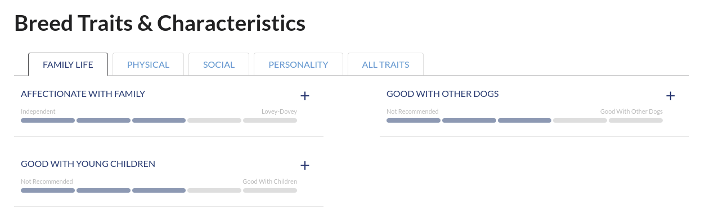
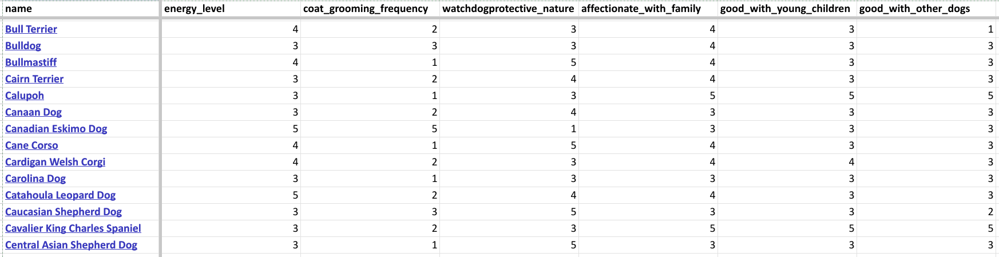

# Dog breeds data
The [American Kennel Club](https://www.akc.org) website provides amazing data about almost all dog breeds, for example:
  

 

However, if you're looking for dog breeds only with specific features (like me – as I want to make sure I’ll be able to give my potential pupil what he/she needs), they don’t provide any filtering options.

Running the code in the [`dogs.ipynb`](dogs.ipynb) Jupyter notebook gives you exactly that, saving the data to [`breeds-formatted.xlsx`](breeds-formatted.xlsx):
  

